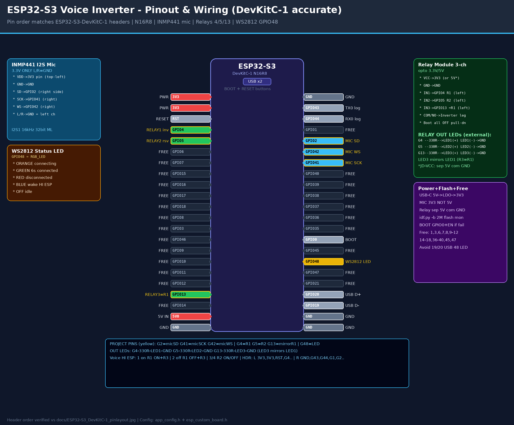

# ESP32-S3 Voice Inverter — Pinout & Schematic (DevKitC-1 accurate)



Target: `ESP32-S3-N16R8 DevKitC-1`, IDF v5.2.7.
Header order verified against `docs/ESP32-S3_DevKitC-1_pinlayout.jpg`.
Source of truth: `main/include/app_config.h` + `components/hardware_driver/boards/include/esp_custom_board.h`

Yellow-bordered pins in the image = YOUR project pins (7 total).
All others = FREE / system.

## 1. Wiring table (wire this)

| ESP32-S3 pin | Header side | Connects to | Notes |
|---|---|---|---|
| 3V3 (either) | left top | INMP441 VDD + Relay VCC | Mic MUST be 3.3V, never 5V |
| GND (any) | both | INMP441 GND + Relay GND + L/R | Common ground everywhere |
| GPIO2 | right #5 | INMP441 SD (data) | `GPIO_I2S_SDIN`, I2S1 DIN |
| GPIO41 | right #7 | INMP441 SCK | `GPIO_I2S_SCLK` BCLK |
| GPIO42 | right #6 | INMP441 WS | `GPIO_I2S_LRCK` LRCLK |
| GPIO4 | left #4 | Relay IN1 + LED1 (+) via 330R | Relay ID 1 — `inverter on/off`; LED1 (−) to GND |
| GPIO5 | left #5 | Relay IN2 + LED2 (+) via 330R | Relay ID 2 — reserved; LED2 (−) to GND |
| GPIO13 | left #19 | Relay IN3 + LED3 (+) via 330R | Mirrors Relay 1, no own ID; LED3 (−) to GND |
| GPIO48 | right #16 | on-board WS2812 | Status LED, no wiring |
| GPIO43/44 | right #2-3 | USB-UART logs | Debug console |
| GPIO19/20 | right #19-20 | Native USB D-/D+ | Leave alone |
| GPIO0 / RST | — | BOOT + RESET buttons |strapping / flash |
| 5V0 | left #21 | Relay JD-VCC (opt) | See relay power note |


## 2. ASCII schematic

```
              USB-C 5V
                 |
         +-------+------------------+
         |  ESP32-S3-N16R8 DevKitC1 |
         |                          |
  3V3 ---+---> INMP441 VDD          |
  GND ---+---> INMP441 GND          |
  G2  --------> INMP441 SD (DIN)    |
  G41 --------> INMP441 SCK (BCLK)  |
  G42 --------> INMP441 WS (LRCK)   |
  GND --------> INMP441 L/R (GND=left ch)|
         |                          |
  G4  --------> Relay IN1 (R1) ----> Inverter leg 1 (COM/NO)
  G5  --------> Relay IN2 (R2) ----> spare
  G13 --------> Relay IN3 (=R1 mirror)
         |                          |
  G48 --[on-board]--> WS2812 LED    |
         |  orange=connecting       |
         |  green 6s=connected      |
         |  red=disconnected        |
         |  blue=wake HI ESP        |
         +--------------------------+
  G43/G44 = UART logs, G19/G20 = USB, G0/EN = BOOT/RESET
```

I2S: I2S_NUM_1, 16 kHz, 32-bit, stereo, format ML (bsp_board.c).
Relays: active-HIGH, boot OFF with pull-down (relay_gpio_init).
Free GPIOs: 1, 3, 6-12, 14-18, 36-40, 45, 47 (+43/44 if you give up logs). Avoid 19/20/48.

## 1b. DevKitC-1 header order (matches your reference photo)

Left header top-to-bottom: 3V3, 3V3, RST, G4*, G5*, G6, G7, G15, G16,
G17, G18, G8, G3, G46, G9, G10, G11, G12, G13*, G14, 5V0, GND.
Right header top-to-bottom: GND, G43, G44, G1, G2*, G42*, G41*, G40,
G39, G38, G37, G36, G35, G0, G45, G48*, G47, G21, G20, G19, GND, GND.
(* = your project pins — also yellow-bordered in the PNG.)

## 3. Relay power — important

- Small 3.3V relay board: power VCC from ESP32 3V3, GND common.
- 5V opto relay (recommended for inverter): remove JD-VCC jumper,
  JD-VCC to separate 5V supply, relay GND to ESP32 GND (common),
  VCC (logic side) to ESP32 3V3, IN1/2/3 to GPIO 4/5/13.
- Inverter switch leg goes through COM/NO contacts. Size relay for
  your inverter current, add fuse as needed.

## 4. Mic notes

- INMP441 VDD = 3.3V only. L/R pin to GND selects left channel
  (firmware reads left sample and mirrors it).
- Keep mic wires short, away from relay/inverter AC wiring.

## 5. Flash

  idf.py set-target esp32s3
  idf.py -b 2000000 flash monitor

If auto-reset fails: hold BOOT (GPIO0), tap EN/RESET, release BOOT.
